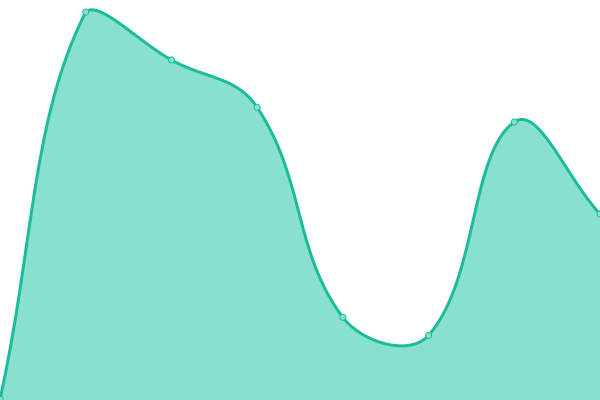
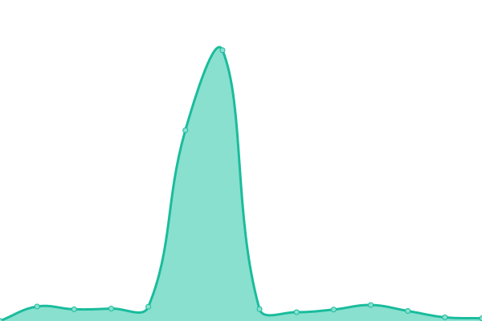
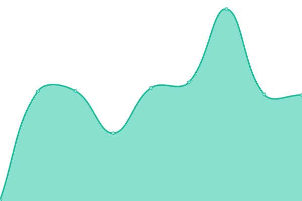

# [📈 Live Status](https://zazathomas.github.io/upptime-monitor): <!--live status--> **🟥 Complete outage**

This repository contains the open-source uptime monitor and status page for [Zaza](https://zazathomas.github.io/upptime-monitor), powered by [Upptime](https://github.com/upptime/upptime).

With [Upptime](https://upptime.js.org), you can get your own unlimited and free uptime monitor and status page, powered entirely by a GitHub repository. We use [Issues](https://github.com/zazathomas/upptime-monitor/issues) as incident reports, [Actions](https://github.com/zazathomas/upptime-monitor/actions) as uptime monitors, and [Pages](https://zazathomas.github.io/upptime-monitor) for the status page.

<!--start: status pages-->
<!-- This summary is generated by Upptime (https://github.com/upptime/upptime) -->
<!-- Do not edit this manually, your changes will be overwritten -->
<!-- prettier-ignore -->
| URL | Status | History | Response Time | Uptime |
| --- | ------ | ------- | ------------- | ------ |
|  Keycloak | 🟥 Down | [keycloak.yml](https://github.com/zazathomas/upptime-monitor/commits/HEAD/history/keycloak.yml) | 

 0ms
     
 | 

<a href="https://zazathomas.github.io/upptime-monitor/history/keycloak">0.00%</a>
    

|  Teleport | 🟥 Down | [teleport.yml](https://github.com/zazathomas/upptime-monitor/commits/HEAD/history/teleport.yml) | 

 0ms
     
 | 

<a href="https://zazathomas.github.io/upptime-monitor/history/teleport">0.00%</a>
    

|  Gateway API | 🟥 Down | [gateway-api.yml](https://github.com/zazathomas/upptime-monitor/commits/HEAD/history/gateway-api.yml) | 

 0ms
     
 | 

<a href="https://zazathomas.github.io/upptime-monitor/history/gateway-api">0.00%</a>
    

|  ARGO CD | 🟥 Down | [argo-cd.yml](https://github.com/zazathomas/upptime-monitor/commits/HEAD/history/argo-cd.yml) | 

 0ms
     
 | 

<a href="https://zazathomas.github.io/upptime-monitor/history/argo-cd">0.00%</a>
    

<!--end: status pages-->

[**Visit our status website →**](https://zazathomas.github.io/upptime-monitor)

## 📄 License

- Powered by: [Upptime](https://github.com/upptime/upptime)
- Code: [MIT](./LICENSE) © [Anand Chowdhary](https://anandchowdhary.com), supported by [Pabio](https://pabio.com)
- Data in the `./history` directory: [Open Database License](https://opendatacommons.org/licenses/odbl/1-0/)
